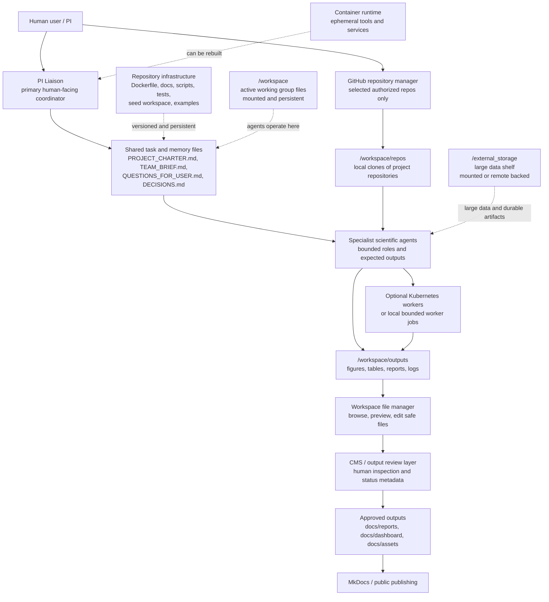

# Architecture

OASIS ScienceClaw is organized around a simple operating model:

```text
GitHub = control plane
repo = memory
container = runtime
```

The repository contains infrastructure, documentation, seed templates, tests, and public outputs. The container runs OpenClaw and scientific tools. The workspace holds active scientific work. External storage holds large data and durable artifacts that should not live in git.



## What Persists

The repository persists through git. The workspace persists through a bind mount or volume. External storage persists outside the image. The container runtime itself should be treated as replaceable.

## Where Humans Intervene

Humans approve publication, deletion, GitHub pushes, new mounts, third-party tools, billed API use, and sensitive claims. The PI Liaison batches questions and routes work so every agent does not interrupt the user directly.

## Where Files Are Inspected

The workspace file manager is the daily inspection surface. It can browse from `/` so users can understand the container layout, but it hides sensitive paths and restricts write operations to safe project areas such as `/workspace`, `/workspace/outputs`, `/data/outputs`, and `/tmp`. This makes the container visible without making system files casually editable.

## Where Project Repositories Live

The GitHub Repository Manager connects selected external project repositories. These are different from the ScienceClaw container repository. Authorized repositories clone into `/workspace/repos/`, and agents work through branches and pull requests. The manager blocks direct pushes to `main` and `master` and stores only repository metadata in `/workspace/.openclaw-github/authorized-repos.yaml`.

## Where Publishing Occurs

Private work begins in `/workspace` or `/data/outputs`. The CMS review layer records status and provenance. Only reviewed artifacts move into `docs/` for MkDocs or public publication.
