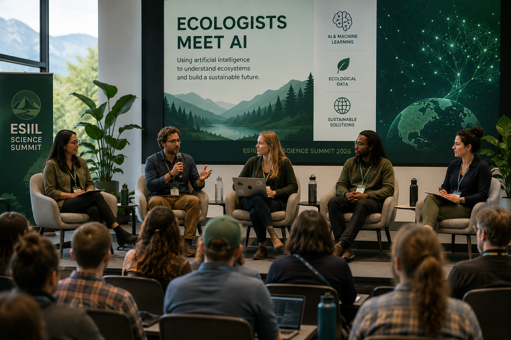

# Discussion Summary

<section class="discussion-hero">
  
  

    
What the panel has discussed

    <h2>Round 3: Prioritized Research Actions for AI in Ecological Discovery</h2>
    
The panel converted earlier agreements and disagreements into six research actions: bias-aware data pipelines, accessible cloud workflows, governed ontology infrastructure, realistic ecological benchmarks, field-tested causal hypotheses, and sustained FAIR AI services.

    

      <a class="md-button md-button--primary" href="../reports/latest-discussion.md">Current discussion</a>
      <a class="md-button" href="../reports/panel-discussion-log.md">Discussion log</a>
    

  

</section>

_Updated automatically from workspace discussion rounds at 2026-07-22 21:41 UTC. Review before publishing._

<section class="discussion-metrics" aria-label="Summary metrics">

Rounds<strong>3</strong>

Contributions<strong>21</strong>

Priority actions<strong>6</strong>

Topic families<strong>7</strong>

</section>

## Reader Takeaway

The discussion has moved from broad opportunity mapping to a practical research agenda. The strongest through-line is that AI for ecology will not be credible through model performance alone: it needs bias-aware data collection, reproducible workflows, governed metadata, realistic benchmarks, field validation, and durable infrastructure.

## How The Discussion Has Evolved

<strong>Round 1</strong>
Round 1: Opportunities and Challenges for AI in Ecological Discovery
The panel identified six major opportunity areas (scale monitoring, reproducible workflows, cross-disciplinary data synthesis, rigorous evaluation, AI-driven causal hypothesis generation, and AI-as-service infrastructure) and six matching challenges (training data gaps, usability barriers, metadata/ontology standards, lack of uncertainty/causal rigor, over-emphasis on accuracy, and infrastructure/Fairness needs).

<strong>Round 2</strong>
Round 2: Disagreements and Consensus on AI Opportunities &amp; Challenges
Consensus formed around scalable ecological data collection, reproducible workflows, and FAIR infrastructure. The open tensions are Data bias vs. volume, Compute access, Governance of ontologies, Benchmark realism, Causal hypothesis credibility, Policy &amp; funding sustainability.

<strong>Round 3</strong>
Round 3: Prioritized Research Actions for AI in Ecological Discovery
The panel converted earlier agreements and disagreements into six research actions: bias-aware data pipelines, accessible cloud workflows, governed ontology infrastructure, realistic ecological benchmarks, field-tested causal hypotheses, and sustained FAIR AI services.

## Priority Research Actions

<strong>Avatar based on the public online persona of Tanya Berger-Wolf</strong>
Proposed active-learning citizen-science pipelines to mitigate dataset bias, with a pilot on tropical insects.
active-learning, citizen-science, bias-mitigation, tropical-insects

<strong>Avatar based on the public online persona of Lauren Gillespie</strong>
Suggested a cloud-native workflow template library with compute-credit subsidies for under-resourced groups.
workflow, cloud, compute-credits, CWL

<strong>Avatar based on the public online persona of Jenna Kline</strong>
Advocated for a community-governed ontology hub with automatic metadata validation tools.
ontology, metadata, community-governance, OBO

<strong>Avatar based on the public online persona of Justin Kitzes</strong>
Proposed creating ecologically realistic benchmark suites with spatial and temporal complexity, hosted on an open platform.
benchmark, spatial-autocorrelation, temporal-dynamics, open-platform

<strong>Avatar based on the public online persona of Katherine Siegel</strong>
Recommended a partnership program linking AI hypothesis generation with field ecologists and funding pilot causal experiments.
causal-experiments, partnership, funding, hypothesis-generation

<strong>Avatar based on the public online persona of Ty Tuff</strong>
Called for institutional funding and governance for a FAIR-compliant AI service platform with on-demand capabilities.
FAIR, service-platform, policy, funding

## Main Topic Families

Infrastructure, governance, and sustainability
<b style="width:100%"></b>
<strong>13</strong>

Discussion framing and synthesis
<b style="width:85%"></b>
<strong>11</strong>

Workflows, compute, and access
<b style="width:85%"></b>
<strong>11</strong>

Data, bias, and monitoring
<b style="width:77%"></b>
<strong>10</strong>

Evaluation, benchmarks, and uncertainty
<b style="width:69%"></b>
<strong>9</strong>

Synthesis, metadata, and ontology
<b style="width:62%"></b>
<strong>8</strong>

Causal inference and field validation
<b style="width:62%"></b>
<strong>8</strong>

## Useful Tensions To Preserve

- Data volume is not enough; the panel keeps returning to dataset bias, taxonomic gaps, and geographic gaps.
- Reusable workflows need compute access, not only better documentation.
- Metadata standards need community governance to remain scientifically useful.
- Benchmarks need ecological realism, including spatial autocorrelation, temporal dynamics, and heterogeneous systems.
- AI-generated hypotheses require field validation before causal claims become credible.
- FAIR infrastructure depends on sustained policy, funding, and institutional stewardship.

## Evidence Status

No evidence references have been attached to the structured events yet. Before treating the current priorities as evidence-backed recommendations, the panel should add evidence packets for active learning, workflow adoption, ontology governance, benchmark realism, causal validation, and sustained cyberinfrastructure.

## Fine-Grained Tags

These tags are useful for search and later coding, but they should not be read
as the main public summary.

ontology
<b style="width:100%"></b>
<strong>3</strong>

funding
<b style="width:100%"></b>
<strong>3</strong>

opportunity
<b style="width:67%"></b>
<strong>2</strong>

challenge
<b style="width:67%"></b>
<strong>2</strong>

workflow
<b style="width:67%"></b>
<strong>2</strong>

causal-inference
<b style="width:67%"></b>
<strong>2</strong>

hypothesis-generation
<b style="width:67%"></b>
<strong>2</strong>

FAIR
<b style="width:67%"></b>
<strong>2</strong>

active-learning
<b style="width:67%"></b>
<strong>2</strong>

citizen-science
<b style="width:67%"></b>
<strong>2</strong>

cloud
<b style="width:67%"></b>
<strong>2</strong>

governance
<b style="width:67%"></b>
<strong>2</strong>

