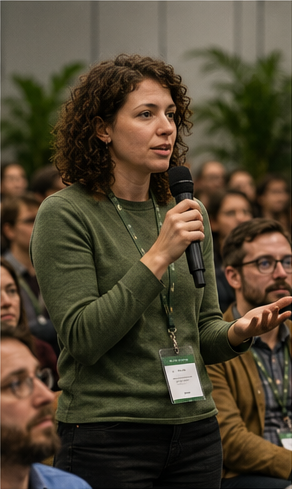
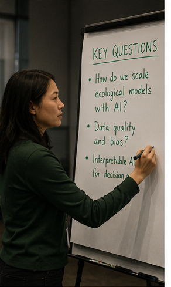
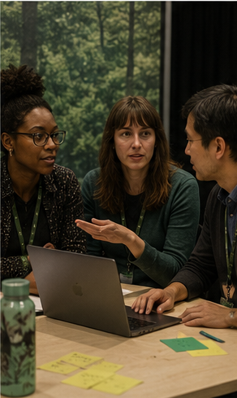
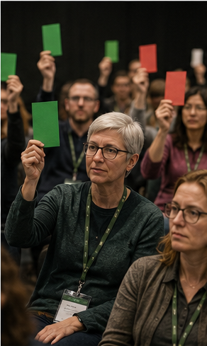
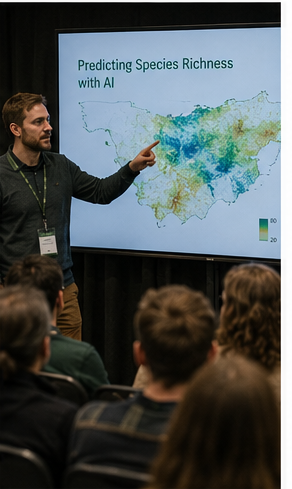

---
hide:
  - toc
---

<section class="site-photo-hero">
  
  

    
OASIS Scientific Discussion Panel

    <h1>Ecologists meet AI.</h1>
    
A disclosed simulated panel tracks how artificial intelligence could change ecological discovery, uncertainty, evidence, and decision-making.

    

      <a class="md-button md-button--primary" href="reports/latest-discussion.md">Current discussion</a>
      <a class="md-button" href="dashboard/discussion-dashboard.md">Summary</a>
      <a class="md-button" href="reports/panel-discussion-log.md">Log</a>
    

  

</section>

OASIS Scientific Discussion Panel is a public-facing record of a simulated
scientific panel about **AI for Ecology: Accelerating Discoveries, Reducing
Uncertainties, and Scaling Solutions**.

The panel is designed to make scientific reasoning easier to follow. It keeps
track of what was discussed, where panelists agreed, where they disagreed, which
questions stalled, and what should come next.

## What The Panel Is

The panel is a disclosed simulation of a moderated scientific discussion. It is
not presented as private statements from real people. Its job is to test how a
scientific working group might use AI agents to preserve memory, surface
uncertainty, and turn ongoing discussion into reviewable public summaries.

The current panel includes a moderator, six scientific panelists, an organizer,
and a discussion-intelligence agent that records topics, stance, decisions, open
questions, and follow-up work.

  <a class="homepage-card" href="panel-architecture.md">
    <strong>The panel</strong>
    
Who is represented, what roles exist, and how the discussion is framed.

    Read the description
  </a>
  <a class="homepage-card" href="reports/latest-discussion.md">
    <strong>Current discussion</strong>
    
The latest reviewed brief: what dominated, what stalled, and what remains unresolved.

    Read the brief
  </a>
  <a class="homepage-card" href="dashboard/discussion-dashboard.md">
    <strong>Discussion summary</strong>
    
A compact view of the main themes and which threads have or have not developed.

    See the summary
  </a>

## What They Are Discussing

The panel is currently focused on how ecological foundation models should be
evaluated. The main tension is whether predictive accuracy counts as ecological
discovery, or whether stronger evidence is needed to show mechanism,
generalization, and usefulness across under-sampled ecosystems.

Three themes are carrying the conversation:

- Evidence traceability in every public summary.
- Benchmark governance for ecological AI.
- Interpreting foundation-model results without overclaiming discovery.

## What They Have Discussed

  
  
  
  
  

The first summarized session centered on ecological foundation models,
benchmark governance, evidence traceability, open science workflow, and
interpretability. Remote sensing and agent governance came up, but did not yet
develop into sustained discussion.

The [discussion summary](dashboard/discussion-dashboard.md) shows the current
shape of the conversation. The [discussion log](reports/panel-discussion-log.md)
holds dated entries as the panel updates them.

## Representation

The panelists are disclosed simulations informed by documented expertise and
source material. They do not speak for the real people whose work inspired the
perspectives, and generated statements must never be presented as private views.
