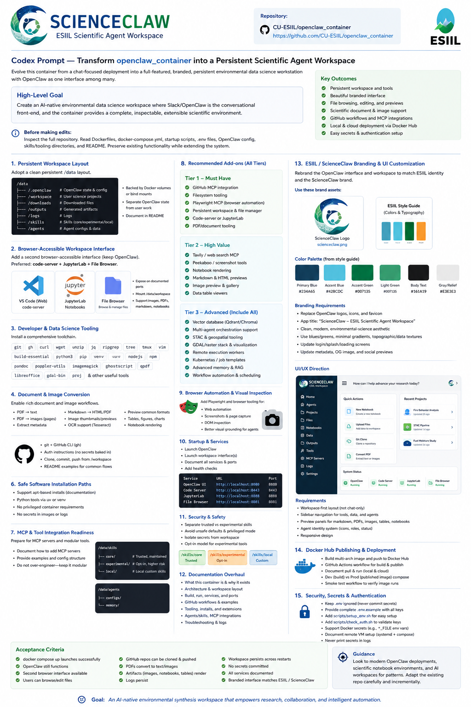
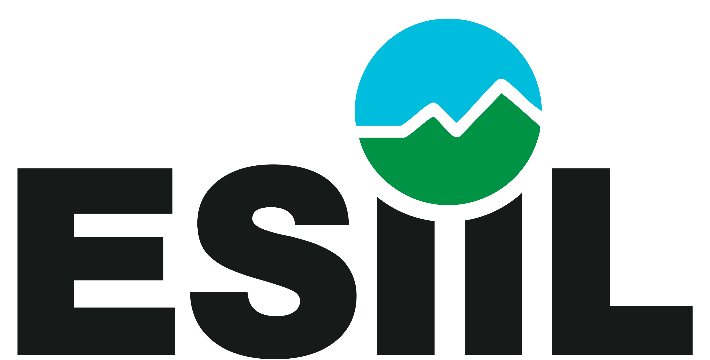

---
hide:
  - toc
---

<section class="hero" markdown>

OASIS product site

# OpenClaw

A collaborative workspace for environmental data science, working groups, and agent-supported synthesis.

OpenClaw brings together a local scientific runtime, a shared agent workspace, and a publication path that keeps reviewed outputs separate from drafts, notes, and large data.

[Start Here](start-here/index.md){ .md-button .md-button--primary }
[First 10 Minutes](start-here/first-10-minutes.md){ .md-button }
[Launch OpenClaw](use/launch-locally.md){ .md-button }
[Troubleshooting](troubleshooting.md){ .md-button }

</section>

<section class="visual-interlude" markdown>

{ .visual-interlude-mark }

### A field-ready collaboration space

OpenClaw is built to feel like part of the OASIS ecosystem: calm enough for onboarding, structured enough for scientific review, and flexible enough for real projects, repositories, and outputs.

</section>

<section class="section-band" markdown>

Start Here

## Learn the system in a few minutes

The fastest path is simple: understand the workspace, launch it locally, and choose the right path for your role.

<a class="homepage-card" href="start-here/what-is-openclaw/">
  <strong>What is OpenClaw?</strong>
  
See the full picture first: container, agent workspace, and scientific collaboration layer.

  Understand the system
</a>

<a class="homepage-card" href="start-here/first-10-minutes/">
  <strong>First 10 Minutes</strong>
  
Follow the calm startup path, connect to the main chat page, and avoid the common first-run traps.

  Launch quickly
</a>

<a class="homepage-card" href="start-here/user-paths/">
  <strong>Choose Your Path</strong>
  
Pick the right entry point for scientists, working group leads, maintainers, and customizers.

  Find your route
</a>

</section>

<section class="section-band section-band--soft" markdown>

Use OpenClaw

## Run the workspace without learning the whole stack

These pages cover the daily experience: start the local system, find files, manage repositories, and keep project memory in predictable places.

<a class="homepage-card" href="use/launch-locally/">
  <strong>Launch Locally</strong>
  
Bring up the local stack, connect to the main gateway, and keep Docker details lightweight.

  Run OpenClaw
</a>

<a class="homepage-card" href="workspace-file-manager/">
  <strong>Workspace File Manager</strong>
  
Browse the private workspace, inspect outputs, and understand what belongs in each area.

  Manage files
</a>

<a class="homepage-card" href="github-repository-manager/">
  <strong>GitHub Repository Manager</strong>
  
Authorize project repositories, clone them into the workspace, and keep contributions bounded.

  Manage GitHub
</a>

<a class="homepage-card" href="use/where-files-go/">
  <strong>Where Files Go</strong>
  
Learn the repository, workspace, output, and storage boundaries that keep the system legible.

  Place work well
</a>

<a class="homepage-card" href="use/tasks-decisions-checkpoints/">
  <strong>Tasks, Decisions, Checkpoints</strong>
  
Use lightweight documents to preserve memory, handoffs, and review-ready state.

  Keep context
</a>

</section>

<section class="visual-interlude visual-interlude--ecosystem" markdown>

### Designed for synthesis teams

Working groups are the heart of the site. OpenClaw is most useful when it supports a project team, not just a single terminal session.

{ .visual-interlude-wordmark }

</section>

<section class="section-band section-band--feature" markdown>

Working Groups

## Build a scientific working group, not just a chat session

OpenClaw’s strongest feature is its working-group model: one human-facing PI Liaison, bounded specialist roles, shared project files, and clear review gates before anything becomes public.

<a class="homepage-card" href="oasis-template/">
  <strong>Template Mode</strong>
  
Start from a reusable working-group structure with memory, decisions, review files, and project scaffolding.

  Spawn a project
</a>

<a class="homepage-card" href="agent-team/">
  <strong>Agent Team</strong>
  
Meet the PI Liaison and the supporting roles that keep questions, analysis, and review organized.

  See the roles
</a>

<a class="homepage-card" href="working-group/">
  <strong>Human Review Gates</strong>
  
Keep risky actions, publication decisions, and sensitive claims behind clear human approval points.

  Protect the workflow
</a>

<a class="homepage-card" href="use/outputs-and-reports/">
  <strong>Outputs and Reports</strong>
  
Track figures, reports, logs, tables, and metadata so every output stays inspectable and traceable.

  Review outputs
</a>

<a class="homepage-card" href="publishing-workflow/">
  <strong>Publishing Workflow</strong>
  
Promote reviewed artifacts into public docs without mixing private drafts into the published site.

  Publish science
</a>

</section>

<section class="section-band section-band--soft" markdown>

Data and Storage

## Keep data large, discoverable, and separate from project memory

Use the storage model to decide what belongs in git, what belongs in the workspace, and what should stay in mounted or remote storage.

<a class="homepage-card" href="storage-model/">
  <strong>Storage Model</strong>
  
Learn the three-zone layout: repository, workspace, and external storage.

  See the model
</a>

<a class="homepage-card" href="storage/local-mounts/">
  <strong>Local Mounts</strong>
  
Mount project folders narrowly and keep the agent-visible surface as small as possible.

  Use local data
</a>

<a class="homepage-card" href="storage/remote-storage/">
  <strong>Remote Storage</strong>
  
Connect remote stores without turning the repository into a dumping ground for bulky artifacts.

  Connect storage
</a>

<a class="homepage-card" href="storage/stream-first-data/">
  <strong>Stream-First Data</strong>
  
Prefer discovery and lazy access patterns before downloading large environmental datasets.

  Work at scale
</a>

<a class="homepage-card" href="storage/secrets/">
  <strong>Storage Secrets</strong>
  
Keep credentials local, documented, and separate from reports, screenshots, and markdown memory.

  Handle secrets safely
</a>

</section>

<section class="section-band section-band--compact" markdown>

Maintainer / Advanced

## Customize and extend when you need to

All the technical depth is still here. It is simply quieter in the navigation and lower on the page.

<a href="architecture/">Architecture</a>
<a href="setup/">Setup</a>
<a href="operations/">Operations</a>
<a href="security/">Security</a>
<a href="model-routing/">Model Routing</a>
<a href="slack-integration/">Slack</a>
<a href="kubernetes-workers/">Kubernetes Workers</a>
<a href="distributed-runtime/">Distributed Runtime</a>
<a href="workspace-cms/">Workspace CMS</a>
<a href="reference/glossary/">Glossary</a>

</section>
