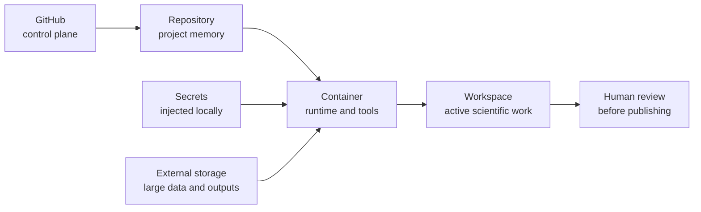

# Start Here

This section is the shortest path into OpenClaw.

OpenClaw gives you a ready-to-use scientific runtime, a shared workspace for people and agents, and a calmer way to move from setup to outputs.

!!! note "You do not need to understand Docker deeply to begin"
    Start by treating the container as a portable lab bench: it holds the tools. The repository is the lab notebook: it holds the memory.

## The Core Mental Model



Repeat this when you feel lost:

**GitHub = control plane. Repo = memory. Container = runtime. Secrets are injected, never stored. External storage holds large durable data.**

## First Path

1. Read [What is OpenClaw?](what-is-openclaw.md).
2. Walk through [First 10 Minutes](first-10-minutes.md).
3. Launch the workspace with [Launch Locally](../use/launch-locally.md).
4. Learn [Where Files Go](../use/where-files-go.md).
5. Use [Troubleshooting](../troubleshooting.md) if the browser, token, or startup flow feels strange.

The calm command loop is:

```bash
make init-working-group
make doctor
make checkpoint
```

## User Modes

| Mode | Start With | Main Concern |
| --- | --- | --- |
| Everyday Scientist | [What is OpenClaw?](what-is-openclaw.md) | Understanding the system without infrastructure overload |
| Working Group Lead | [Template Mode](../oasis-template.md) | Making a reusable working group from the base image |
| Data/Workflow Maintainer | [Where Files Go](../use/where-files-go.md) | Data placement, provenance, and reproducible outputs |
| Infrastructure Admin | [Operations](../operations.md) | Ports, credentials, startup, and deployment |
| Developer/Customizer | [Architecture](../architecture.md) | Extending agents, docs, branding, and workflows |
